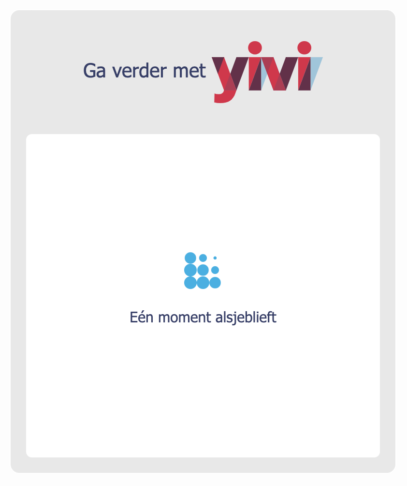
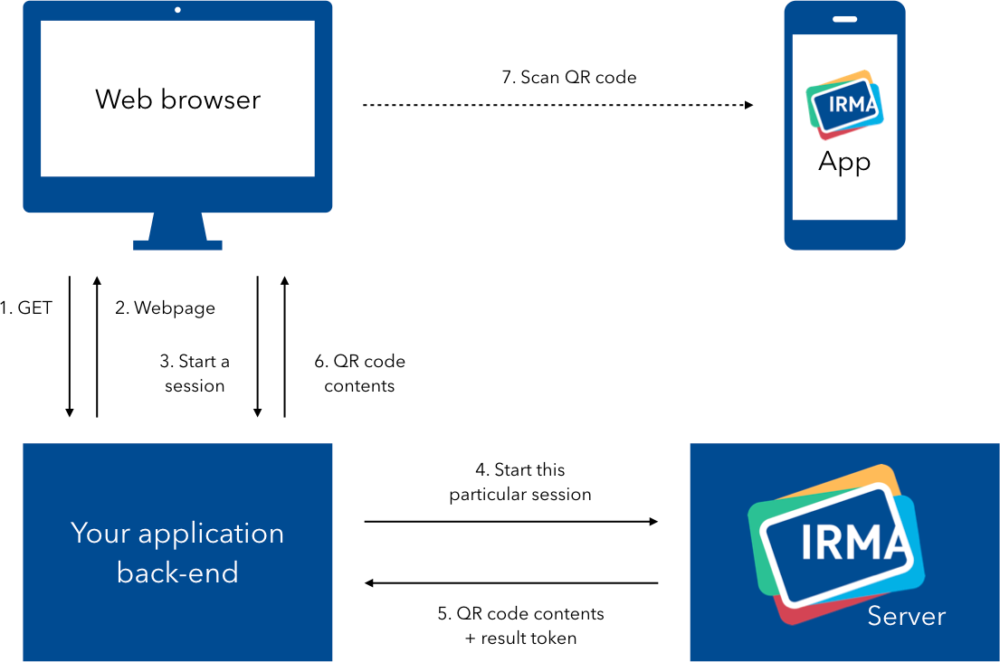
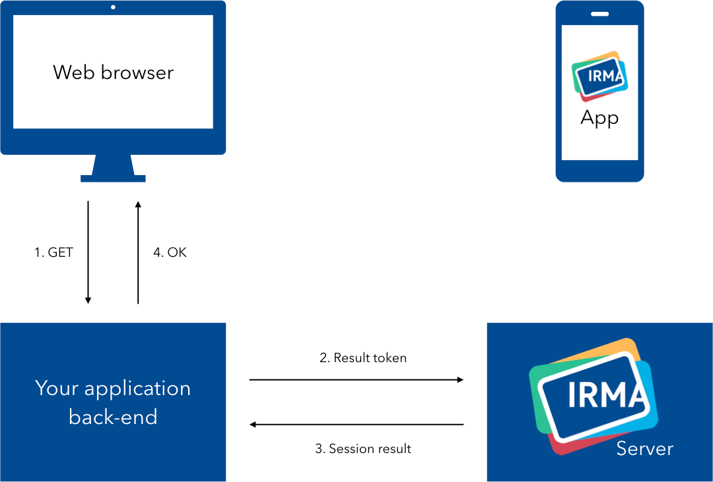
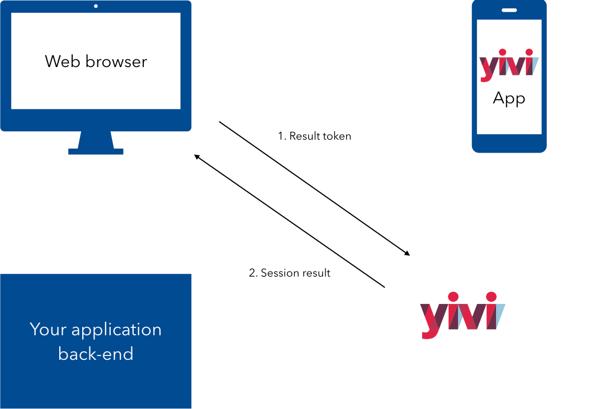

# Yivi frontend packages

Welcome to this repository! Yivi frontend packages is a collection of related
packages, that together form a Javascript "client" to the IRMA server. The
primary purpose of these packages is to have a very flexible Yivi client in the
web browser, but you can also use them to build a NodeJS client.

The browser version, by default, will look like this:



The client is designed in such a way that you can combine the plugins you need
and configure them in many useful ways. So the above design can easily be
removed (for your NodeJS application) or swapped out for a popup version.

## Supported Yivi flows

This library is designed to be flexible in usage. In this section we describe
how some imaginable Yivi flows and how these flows map onto this library. We
also mention points of attention for developers when implementing such a flow.

As a general best practice, we don't want to allow the web browser to freely
initialize the Yivi flow. Also, in many cases we don't want the result of the
disclosure or signing request to be revealed to the browser. The code that is
running in the web browser could be compromized by the user or third party
injected code.

### Talking to IRMA server through a proxy

The most highly recommended flow that combats these issues
is one where the Javascript client talks to the IRMA server through your own
application back-end, that functions as a proxy.


_Starting a session through a proxy_

In this flow the Yivi Javascript client requests the back-end for a new session
to be started, and it is the back-end that actually starts the session. In this
flow the web browser can't manipulate the session that gets started or see the
contents of the resulting disclosure:


_Getting the session result through a proxy_

<details>
  <summary>How to implement this flow</summary>

  #### Client side

  You can use either the wrapper package [`yivi-frontend`](yivi-frontend) or
  combine your own packages if you have a build system like webpack.

  ##### `yivi-frontend`

  ```html
<script type="text/javascript" src="[link to yivi-frontend, see its readme]"></script>

<script type="text/javascript">
  const yiviWeb = yivi.newWeb({
    debugging: false,            // Enable to get helpful output in the browser console
    element:   '#yivi-web-form', // Which DOM element to render to

    // Back-end options
    session: {
      // Point this to your controller:
      url: 'https://my-server.domain/irma-endpoint',

      start: {
        url: o => `${o.url}/start`,
        method: 'GET'
      },
      result: {
        url: (o, {sessionPtr, sessionToken}) => `${o.url}/result`,
        method: 'GET'
      }
    }
  });

  yiviWeb.start()
  .then(result => console.log("Successful disclosure! 🎉", result))
  .catch(error => console.error("Couldn't do what you asked 😢", error));
</script>
  ```

  ##### Combining your own packages

  ```bash
$ npm install --save-dev yivi-css yivi-core yivi-web yivi-client
  ```

  ```javascript
require('@privacybydesign/yivi-css');

const YiviCore = require('@privacybydesign/yivi-core');
const Web      = require('@privacybydesign/yivi-web');
const Client   = require('@privacybydesign/yivi-client');

const yivi = new YiviCore({
  debugging: false,            // Enable to get helpful output in the browser console
  element:   '#yivi-web-form', // Which DOM element to render to

  // Back-end options
  session: {
    // Point this to your controller:
    url: 'https://my-server.domain/yivi-endpoint',

    start: {
      url: o => `${o.url}/start`,
      method: 'GET'
    },
    result: {
      url: (o, {sessionPtr, sessionToken}) => `${o.url}/result`,
      method: 'GET'
    }
  }
});

yivi.use(Web);
yivi.use(Client);

yivi.start()
.then(result => console.log("Successful disclosure! 🎉", result))
.catch(error => console.error("Couldn't do what you asked 😢", error));
  ```

  #### Server side

  Then, on the server side, you have to implement the `start` and `result`
  actions on your `irma-endpoint` controller.

  `start` should make a call to the IRMA server and start the Yivi session
  there. Then, strip the result token from the response JSON and send the rest
  back in the response to the client.

  `results` can fetch the result from the IRMA server using the result token
  that we stripped off the response earlier. Whatever you return to the client
  will be what the Promise on the last few lines resolves to.

  As you saw in the snippets above, you can change the request types and URLs of
  both actions. But you can also change the request body, headers and how to get
  the QR code from the server's response. See the
  [`yivi-client`](plugins/yivi-client) documentation for details.
</details>

### Talking to IRMA server directly, with signed request

Another supported flow is one where the Javascript client talks to the IRMA
server directly, and is itself responsible for starting the session there.


_Starting a session directly, with signed request_

The payload that gets sent to the IRMA server to start the session is signed by
your application back-end, so the web browser can't alter the request and the
IRMA server can verify its authenticity.

However, the web browser will be able to see the resulting disclosure or signed
contract, because the web browser will be the one receiving the result token
from the IRMA server. This may be an issue for some scenario's.
In these scenarios you can get [signed JWTs as result](https://irma.app/docs/irma-server/#signed-jwt-session-results)
from the IRMA server. This flow with receiving JWTs as result is not
elaborated in this example.


_Getting the session result directly_

<details>
  <summary>How to implement this flow</summary>

  #### Client side

  You can use either the wrapper package [`yivi-frontend`](yivi-frontend) or
  combine your own packages if you have a build system like webpack.

  ##### `yivi-frontend`

  ```html
<script type="text/javascript" src="[link to yivi-frontend, see its readme]"></script>

<script type="text/javascript">
  const yiviRequest = 'signed request here';

  const yiviWeb = yivi.newWeb({
    debugging: false,            // Enable to get helpful output in the browser console
    element:   '#yivi-web-form', // Which DOM element to render to

    // Back-end options
    session: {
      // Point this to your IRMA server:
      url: 'https://irma-server.my-server.domain/',

      start: {
        method: 'POST',
        body: yiviRequest,
        headers: { 'Content-Type': 'text/plain' },
      }
    }
  });

  yiviWeb.start()
  .then(result => console.log("Successful disclosure! 🎉", result))
  .catch(error => console.error("Couldn't do what you asked 😢", error));
</script>
  ```

  ##### Combining your own packages

  ```bash
$ npm install --save-dev yivi-css yivi-core yivi-web yivi-client
  ```

  ```javascript
require('@privacybydesign/yivi-css');

const YiviCore = require('@privacybydesign/yivi-core');
const Web      = require('@privacybydesign/yivi-web');
const Client   = require('@privacybydesign/yivi-client');

const yiviRequest = document.getElementById('yivi-request').value;

const yivi = new YiviCore({
  debugging: false,            // Enable to get helpful output in the browser console
  element:   '#yivi-web-form', // Which DOM element to render to

  // Back-end options
  session: {
    // Point this to your IRMA server:
    url: 'https://irma-server.my-server.domain/',

    start: {
      method: 'POST',
      headers: { 'Content-Type': 'application/json' },
      body: yiviRequest
    }
  }
});

yivi.use(Web);
yivi.use(Client);

yivi.start()
.then(result => console.log("Successful disclosure! 🎉", result))
.catch(error => console.error("Couldn't do what you asked 😢", error));
  ```

  #### Server side

  On the server side you have to render the signed request in your view, or
  provide some other method of getting the signed request to the client. This is
  left as an exercise for the reader, because there are too many ways in which
  to do it.

  The Promise in the last few lines of the code above will now resolve to the
  result of the disclosure or signing flow. Please note that it is now also up
  to you to transfer this information to your back-end **and also to check that
  the result has been properly signed by your IRMA server** and the browser has
  not altered the results in any way.
</details>

### Talking to IRMA server directly, with plain request

This flow is "tolerated" but not recommended in the browser. It's useful for
making quick demos and for local development, but is probably not a good idea
for production. Unless you're writing a NodeJS client, maybe.

The Javascript client talks directly to the IRMA server and starts an arbitrary
session there. The back-end does not need to be involved at all.

<details>
  <summary>How to implement this flow</summary>

  You can use either the wrapper package [`yivi-frontend`](yivi-frontend) or
  combine your own packages if you have a build system like webpack.

  ##### `yivi-frontend`

  ```html
<script type="text/javascript" src="[link to yivi-frontend, see its readme]"></script>

<script type="text/javascript">
  const yiviWeb = yivi.newWeb({
    debugging: false,            // Enable to get helpful output in the browser console
    element:   '#yivi-web-form', // Which DOM element to render to

    // Back-end options
    session: {
      // Point this to your IRMA server:
      url: 'https://irma-server.my-server.domain/',

      start: {
        method: 'POST',
        headers: { 'Content-Type': 'application/json' },
        body: JSON.stringify({
          '@context': 'https://irma.app/ld/request/disclosure/v2',
          'disclose': [
            [
              [ 'pbdf.pbdf.email.email' ],
              [ 'pbdf.sidn-pbdf.email.email' ],
            ]
          ]
        })
      }
    }
  });

  yiviWeb.start()
  .then(result => console.log("Successful disclosure! 🎉", result))
  .catch(error => console.error("Couldn't do what you asked 😢", error));
</script>
  ```

  ##### Combining your own packages

  ```bash
$ npm install --save-dev yivi-css yivi-core yivi-web yivi-client
  ```

  ```javascript
require('@privacybydesign/yivi-css');

const YiviCore = require('@privacybydesign/yivi-core');
const Web      = require('@privacybydesign/yivi-web');
const Client   = require('@privacybydesign/yivi-client');

const yivi = new YiviCore({
  debugging: false,            // Enable to get helpful output in the browser console
  element:   '#yivi-web-form', // Which DOM element to render to

  // Back-end options
  session: {
    // Point this to your IRMA server:
    url: 'https://irma-server.my-server.domain/',

    start: {
      method: 'POST',
      headers: { 'Content-Type': 'application/json' },
      body: JSON.stringify({
        '@context': 'https://irma.app/ld/request/disclosure/v2',
        'disclose': [
          [
            [ 'pbdf.pbdf.email.email' ],
            [ 'pbdf.sidn-pbdf.email.email' ],
          ]
        ]
      })
    }
  }
});

yivi.use(Web);
yivi.use(Client);

yivi.start()
.then(result => console.log("Successful disclosure! 🎉", result))
.catch(error => console.error("Couldn't do what you asked 😢", error));
  ```
</details>

### Skipping the server altogether for development

For development or testing purposes it is often easier to just skip having an
IRMA server at all. You can use the [`yivi-dummy`](plugins/yivi-dummy) package
to this end.

<details>
  <summary>How to implement this flow</summary>

  ```bash
$ npm install --save-dev yivi-css yivi-core yivi-web yivi-dummy
  ```

  ```javascript
require('@privacybydesign/yivi-css');

const YiviCore = require('@privacybydesign/yivi-core');
const Web      = require('@privacybydesign/yivi-web');
const Dummy    = require('@privacybydesign/yivi-dummy');

const yivi = new YiviCore({
  debugging: false,            // Enable to get helpful output in the browser console
  element:   '#yivi-web-form', // Which DOM element to render to
  dummy:     'happy path'      // Specify which flow to emulate
});

yivi.use(Web);
yivi.use(Dummy);

yivi.start()
.then(result => console.log("Successful disclosure! 🎉", result))
.catch(error => console.error("Couldn't do what you asked 😢", error));
  ```

  See [`yivi-dummy`](plugins/yivi-dummy) for more options.
</details>

## Additional documentation

Want to know more about any of the packages? Each package has its own README
file with features, options and purpose of the package:

* [`yivi-core`](yivi-core)
* [`yivi-css`](yivi-css)
* [`yivi-frontend`](yivi-frontend)
* User interaction plugins
  * [`yivi-console`](plugins/yivi-console)
  * [`yivi-popup`](plugins/yivi-popup)
  * [`yivi-web`](plugins/yivi-web)
* State and session management plugins
  * [`yivi-dummy`](plugins/yivi-dummy)
  * [`yivi-client`](plugins/yivi-client)

## Examples

Also, we have several examples available that show how you can use specific
combinations of plugins to achieve different effects:

* Web browser
  * [`yivi-console`](examples/browser/yivi-console)
  * [`yivi-frontend`](examples/browser/yivi-frontend)
  * [`yivi-popup`](examples/browser/yivi-popup)
  * [`yivi-web`](examples/browser/yivi-web)
  * For an `yivi-client` browser example, you can check the [`yivi-frontend` example](examples/browser/yivi-frontend)
* Nodejs
  * [`yivi-console`](examples/node/yivi-console)
  * [`yivi-client`](examples/node/yivi-client)

## Development
When developing a certain package, you can test the package using one of the examples.

We provide development scripts to install all packages, configure all needed links between the packages and
then build the packages. The setup is tested on Linux (debian), MacOS and Windows (in git bash).

These scripts require `npm` (Node.js) to be installed. We recommend you to use **`npm` version 7 or above**.
On `npm` version 6 (LTS) the `--no-save` option of `npm install` is not working correctly.
This leads to unintended changes being made to the `package.json` files.

These development scripts are automatically triggered when installing and building the examples.

```bash
npm install   # To install the dependencies for all packages
npm run link  # To make sure local changes in other yivi-frontend-packages propagate
npm run build # To trigger the building steps for yivi-css and yivi-frontend
```

### Linter
To make a valid PR, your code changes should pass the linter and code formatter. We use 
ESLint for JavaScript and Stylelint for SCSS. You can run these in the following way:

```bash
npm install
npm run lint
```

## Releasing
To release a new version of the `yivi-frontend-packages` you have to run the scripts below.
You need access to the NPM repository in order to release new versions. Otherwise,
these scripts will fail.

```bash
./prepare-release.sh <command line parameters for npm version>
# Check whether all steps succeeded properly, otherwise undo changes and fix issues first.
./release.sh

./prepare-yivi-popup.sh
# Check whether all steps succeeded properly, otherwise fix issues in yivi-popup first.
cd ./plugins/yivi-popup && npm publish --access public

cd ../.. # Go back to root of the repository
./prepare-yivi-frontend.sh
# Check whether all steps succeeded properly, otherwise fix issues in yivi-frontend first.
cd ./yivi-frontend && npm publish --access public

cd .. # Go back to root of the repository
git add -u ./\*package.json ./\*package-lock.json
git commit -m "Version bump"
```

## Documentation
More documentation on how to use this package can be found in the
[Yivi documentation](https://irma.app/docs/irma-frontend/).
